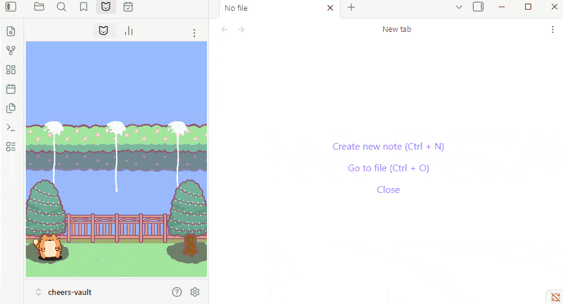
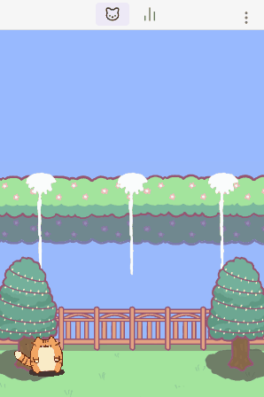
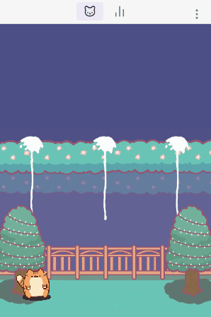
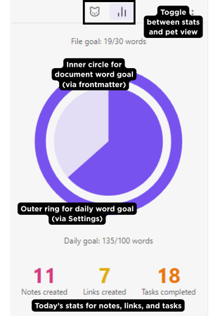
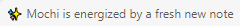
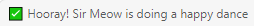
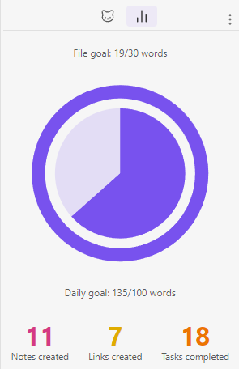
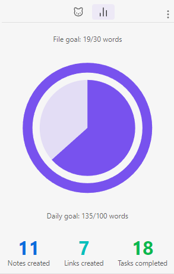

# Cheers 🎉

A vault companion that celebrates your writing, notetaking, linking, and task completions. 

Choose between an animated cat companion, or a daily dashboard with progress bar and number stats. 

Minimal distraction, maximum delight, equally motivating and satisfying.

---

Cheers is your personal cheerleader that automatically celebrates progress and achievements in your Obsidian vault.   

Cheers puts an animated cat companion in your sidebar. As you work in the vault, your companion notices—and celebrates. 

Your companion's celebratory confetti rain is the perfect hit of dopamine when you create new notes, reach word goals (daily or per-document), create new links, or check off a task

Cheers gently rewards with cozy, visually rewarding moments when you make progress. Confetti rain, status bar congratulatory messages, and dashboard increments, celebrate your way! 

(Confetti rain resides in the sidebar only, non-intrusive to your workspace.)

---

## What Cheers Celebrates

Each activity triggers confetti and a status bar message from your pet. Every activity has its own on/off toggle in Settings.

- Create any `.md` note
- Check off a task `- [x]`
- Add a link `[[wiki]]` or `[md](url)`
- Reach your **daily word goal** (set in Settings)
- Reach a **per-note word goal** (set via `word-goal` frontmatter)

---

## Installation

### From Obsidian Community Plugins (Recommended)

1. Open Obsidian **Settings → Community plugins**
2. Browse and search for **"Cheers"**
3. Click **Install**, then **Enable**  

### Manual

1. Download the [latest release](https://github.com/terriyeh/cheers/releases) and grab `main.js`, `manifest.json`, and `styles.css`
2. Create a folder at `.obsidian/plugins/cheers/` in your vault and place the three files inside
3. Reload Obsidian and enable the plugin under Community plugins

---

## UI Preview

Leave on Pet view for a chill companion as you work. Select day or night mode in Settings.

Switch to Today's Stats to recap your progress for the day.

The **Stats tab** shows your daily activity at a glance:

- **Outer ring** — daily word progress toward your goal
- **Inner circle** — per-note word progress for the currently open document
- **Activity tallies** — notes created, links added, and tasks completed today (shown when the corresponding celebration is enabled)

---

## Configuration

1. Open the **Cheers panel** from the ribbon (🎉 icon) or the left sidebar tab
2. Open **Settings → Cheers** and toggle on the activities you want to celebrate
3. Start playing in your vault—your pet does the rest

### Optional Personalization

Personalization options mean you can use what serves your motivation and aesthetics, and turn off what doesn't.

- Customize your pet's name for a personal touch in the celebration message!

  

- Tune your pet's movement speed

- Each celebratory event comes with its own toggle. Only turn on what matters to you.

- Customize overall daily word goals for the vault.

- Additionally, customize daily word goals per document.  

- Choose between day and night background. Seasonal backgrounds to come to keep you immersed even when working in Obsidian!

- Choose between warm and cool dashboard color palettes.

 

---

## FAQ

**Why doesn't my pet load?**
- Confirm you're on Obsidian 1.4.0 or higher
- Disable and re-enable the plugin
- Check the Developer Console (Ctrl+Shift+I) for errors

**Why are celebrations not triggering?**
- Verify the relevant toggle is on in **Settings → Cheers → Celebrations**
- Only one celebration plays at a time — if another is in progress, the next one queues
- Link celebrations require content inside the brackets (`[[]]` alone won't trigger)
- Word goal celebrations fire once when you cross 100% — not on every word after. The daily word goal resets at midnight; per-document word goal is a one-time event.

**Does the daily word count only track new notes, or edits too?**
All edits count. Cheers tracks the net word change each time you save — adding words counts up, deleting words counts down. Rewriting an existing note counts; only the net difference matters. The daily total resets at midnight.

**Will the confetti cover my editor?**
No. Confetti is contained entirely within the Cheers sidebar panel and never overlaps your workspace.

**My word goal stats rings aren't showing in Today's Stats panel.**
- The outer ring requires a daily word goal set in Settings
- The inner circle requires `word-goal: [number]` in the current document's frontmatter.
- The inner circle does not display when the document is not in focus. Simply click on the document to focus it. If there is a `word-goal` frontmatter, the inner circle should display.

---

## Contributing

Issues and pull requests are welcome on [GitHub](https://github.com/terriyeh/cheers).

---

## License

MIT — see [LICENSE](LICENSE) for details.

---

## Say Thanks 🙏

- **Support continued development of Cheers & receive new background(s) of your choice**: Cozy Engineer on Ko-fi *(link coming soon)*
- **Request features**: [GitHub Issues](https://github.com/terriyeh/cheers/issues)

---

*"Let your vault celebrate you."*
